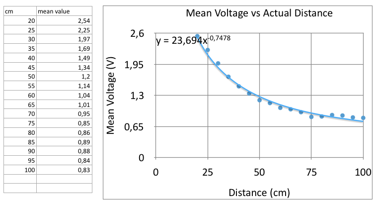

# DAGU Mini Driver Project | Calibration

Calibration is essential for equipment that must respond to external stimuli. All sensor calibration is done to account for any sensor error (statistical or systematic), hysteresis, and other environmental factors that may affect the sensors not working according to manufacturer specification.  

## Contents
- [Distance Sensors](#distance-sensors)
	- [Data Set Building](#data-set-building)
	- [Trend Identification](#trend-identification)
		- [Infrared Sensor](#infrared-sensor)
		- [Ultrasonic Sensor](#ultrasonic-sensor)
	- [Error Identification](#error-identification)
		- [Error Correction](#error-correction)
- [Colour Sensor](#colour-sensor)
	- [Noise Minimising](#noise-minimising)
	- [Data Collection and Trend Identifying](#data-collection-and-trend-identifying)
		- [Primary Calibration](#primary-calibration)
		- [Secondary Calibration](#secondary-calibration)

---

## Distance Sensors
Two distance sensors mounted perpendicular to one another on the robot allow assist in all motion related functionality. Namely these are the Infrared and Ultrasonic distance sensor. Their calibration is highlighted in detail below.

### Data Set Building
All calibration processes take place through a fundamentally iterative methodology. Multiple readings are taken and stored into an array. The array size is directly proportional to the accuracy of the calibration process i.e. the larger the amount of readings collected, the larger the accuracy of the calibration process. The current selected calibration process takes 45 readings. This is purely a subjective amount, it has no prehistoric empirical data to support its effects on the optimization of sensor calibration processes.

### Trend Identification
Each voltage data set is collected with essentially one parameter gradually changing to ensure accurate calibration. This (usually common among different types of sensors) is done incrementally. How this is done for the various sensors used within this project is highlighted below.

##### Infrared Sensor
Trendline identification involves taking the mean of each set of 45 voltage readings from an incrementally changing distance from the provided wall sample. Which is between 20.0 cm - 100.0 cm, in 5.0 cm increments. These mean values are scatter plotted to identify a trendline equation, which is used to convert all voltage readings into distances in cm. Using Microsoft EXCEL or its OS counterpart Numbers, one can generate an exponential trendline i.e. in the form:

```
x = (23.669 / y)^(1 / 0.749)
```
Where:  
x - The desired acual distance
y - The voltage value returned by the infrared sensor

This graphing and trendline equation identification is illustrated in the figure below: 
**Please Update Image Below** 


##### Ultrasonic Sensor
The trendline identification process is similar to that used for the calibration of the Infrared sensor. The only difference is that the sensor itself is intended for short range distances and hence, it is calibrated between 5.0 cm and 25.0 cm in increments of 5.0 cm. Its function also outputs mean distance in cm, instead of mean voltage readings. These mean values are scatter plotted in a similar fashion to that of the infrared sensor. Because the sesnor outputs distance pings instead of voltage readings, the mean value data is used as a correction factor (of sorts) for the sensor outputs. This essentially outputs a Sensor Distance VS Actual Distance curve with an exponetial trendline equation, identified in a similar manner to that of the infrared sensor trendline and of the form:

```
x = (y / 1.0014)^(1 / 1.0013) 
```
Where:  
x - Desired acual distance
y - The distance reading returned by the ultrasonic sensor

The equation above is reffered to as the correction factor equation. It can be used to determine a predictable 'error' variation between the desired distance readings and the readings returned by the Ultrasonic sensor. 


This graphing and trendline equation identification is illustrated in the figure below:


### Error Identification
Error identification is done on distances returned by calibration code. These are also collected into a set of 45 values (an array) per measurement.

To identify error, the sets (described above) are summarized into fundamentally six values, before being logged, tabulated, and graphed. Namely these are:

1. The actual distance e.g. 20.0 cm.
2. The detected distance mean i.e. all 45 values averaged out, e.g. 20.43 cm.
3. The systematic error i.e. difference between actual and detected distance mean, which in this case happens to be 0.43 cm.
4. The minimum value found within the data set, e.g. 19.87 cm.
5. The maximum value found within the data set, e.g. 21.43 cm.
6. The statistical error i.e. the difference between the minimum and maximum values found above, which in this case would be 1.56 cm.

##### Error Correction
Error correction is the process of allowing one's code to account for calculated or known error. For the scope of this project, where the calculated error was found to be less than 2%, error correction will not be practically explored. The amount of error calculated is within a reasonable range where it can regarded as negligible.

---

## Colour Sensor
To allow the robot to identify the order sequence it requires to follow when packing the cups, a colour sensor is used. It is calibrated to distinguish between three cup colours, namely pink, blue, and green. The details of the calibration are discussed below.

### Noise Minimising
The sensor is essentially a light-to-frequency converter. Its output is a square wave (50% duty cycle) with frequency directly proportional to light intensity (irradiance). By covering the sensor's outer perimeter with a 'black' screen (insulation tape), it is possible to reduce the irradiance experienced by the sensor. This allows for an isolated or submersive colour sensing experience. Thus essentially increasing the sensors accuracy.

### Data Collection and Trend Identifying
In a similar fashion to the other sensor calibration processes, the colour sensor is calibrated in a fundametally iterative manner. 

The calibration process is divided into two main colour classification categories, namely primary and secondary calibration. The two are expanded on in the section that follows below.

##### Primary Calibration
The sensor outputs three readings. Namely: a Red, Green, and Blue (RGB) photodiode reading. These values are listed in ascending order over a range of 45 values. The dominant order is recorded as the range sequence the sensor detects for each colour.

The calibration process essentially lists inequalities in the form:

```
 Red < Blue < Green

 		or

 Blue < Green < Red

 		or

 		.
 		.
 		.

 		or

 Red < Green < Blue
```

These are used as a primary means to distinguish between the three cup colours (Pink, Blue, and Green).

##### Secondary Calibration

The output frequency range of the inequalities mentioned above is also recorded. This allows for further distinguishing in cases where the inequalities are simililar for two colours, e.g. the shade of pink, green, or blue of the sample paper representative of the cup colours may cause a similar inequality output. The range is calculated by recording the difference between the maximum and minimum RGB frequencies per sample paper set. This is listed in the form:

```
------------------------------------------------------
						Pink:
------------------------------------------------------
RedFrequencyMax = 967		RedFrequencyMin = 953
GreenFrequencyMax = 583		GreenFrequencyMin = 568
BlueFrequencyMax = 482		BlueFrequencyMin = 474

------------------------------------------------------
						Blue:
------------------------------------------------------
RedFrequencyMax = 461		RedFrequencyMin = 447
GreenFrequencyMax = 557		GreenFrequencyMin = 573
BlueFrequencyMax = 496		BlueFrequencyMin = 482
------------------------------------------------------
						Green:
------------------------------------------------------
RedFrequencyMax = 425		RedFrequencyMin = 441
GreenFrequencyMax = 483		GreenFrequencyMin = 503
BlueFrequencyMax = 612		BlueFrequencyMin = 626
``` 

This allows for the use of an inequality that distinguishes between the samples using frequency ranges i.e.

```
RedFrequencyMax > 600 		// Pink
RedFrequencyMax < 600		// Green
```

Would distinguish between the pink and green smaples if they have the same frequency inequalities for the primary calibration process.